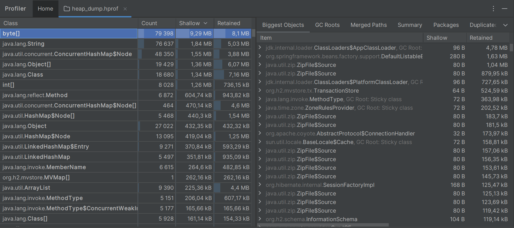
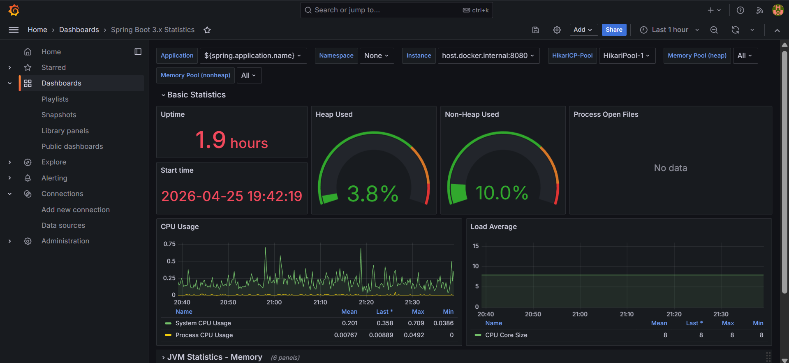
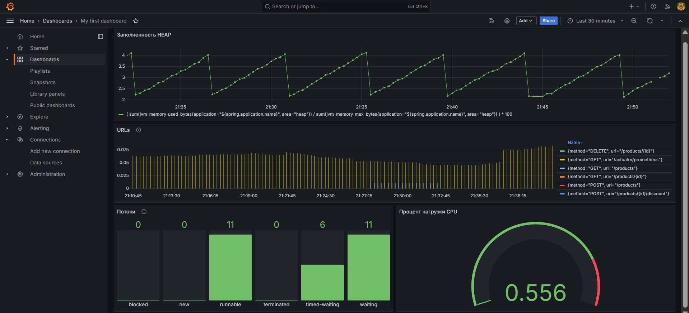
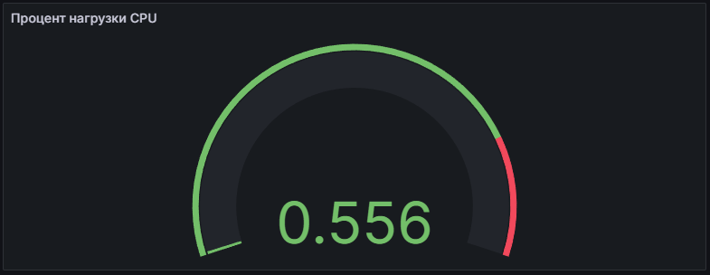
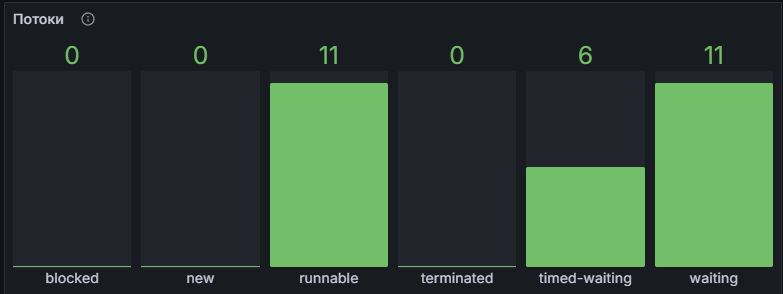
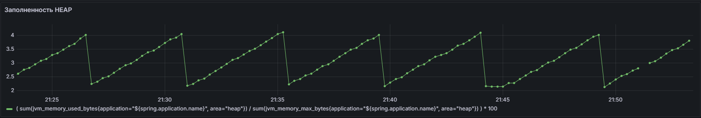
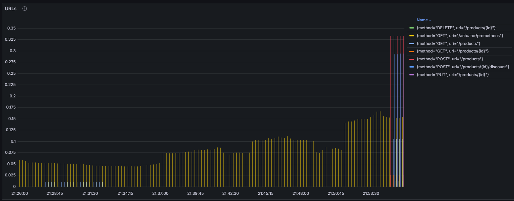

# Troubleshooting Homework - CRUD Service

CRUD сервис с H2 database, мониторингом (Prometheus + Grafana) и CI/CD пайплайном.

## Технологии

- Java 21
- Spring Boot 2.7.14
- H2 Database (Runtime)
- Maven
- Prometheus + Grafana
- GitHub Actions CI/CD
- JaCoCo (покрытие кода)
- Coveralls / SonarQube

## Функциональность

- CRUD операции для сущности Product
- Метод с повышенной нагрузкой (applyDiscount)
- Логирование всех уровней (TRACE, DEBUG, INFO, WARN, ERROR)
- Метрики через Spring Boot Actuator
- Мониторинг через Prometheus + Grafana
- Полное покрытие тестами (>50%)

## Запуск проекта

### В IntelliJ IDEA

1. **Клонируйте репозиторий:**
```bash
git clone https://github.com/anastas-gud/troubleshooting-homework.git
cd troubleshooting-homework
````
2. **Запустите приложение:**
   TroubleshootingHomeworkApplication.java

ИЛИ

````bash
mvn spring-boot:run
````

3. **Запуск Prometheus + Grafana:**
````bash
docker-compose up -d
````


# Thread Dump Analysis

### Инструмент: jstack

### Расчет процента нагрузки:

```Процент нагрузки = (cpu_ms / (elapsed * 1000)) * 100%```

### Таблица анализа потоков (основные потоки):

| Название потока                     | Время жизни потока (elapsed) | Время работы потока (cpu_ms) | Процент нагрузки |
|-------------------------------------|------------------------------|------------------------------|------------------|
| RMI TCP Connection(3)-26.169.63.138 | 312.33                       | 12140.62                     | 3.89%            |
| DestroyJavaVM                       | 423.93                       | 7984.38                      | 1.88%            |
| http-nio-8080-exec-1                | 423.96                       | 2000.00                      | 0.47%            |
| C1 CompilerThread0                  | 433.21                       | 859.38                       | 0.20%            |
| Attach Listener                     | 433.21                       | 484.38                       | 0.11%            |
| http-nio-8080-exec-8                | 423.96                       | 187.50                       | 0.04%            |
| Catalina-utility-1                  | 428.80                       | 93.75                        | 0.02%            |

### Топ-3 потоков по загрузке CPU:

1. **RMI TCP Connection** - 3.89%. Сетевые операции;
2. **DestroyJavaVM** - 1.88%. Поток JVM.
3. **http-nio-8080-exec-1** - 0.47%. Обработка HTTP-запросов.


# Heap Dump Analysis

### Инструмент: jcmd



# Spring Boot Actuator, мониторинг Prometheus + Grafana

### Стандартный дашборд



### Мой дашборд



| Скрин                   | Prom QL                                                                                                                                      | Описание                                                                      |
|-------------------------|----------------------------------------------------------------------------------------------------------------------------------------------|-------------------------------------------------------------------------------|
|  | process_cpu_usage{application=<br/>"${spring.application.name}"} * 100                                                                       | Процент использования<br/>CPU процессом Java (JVM)                            |
|  | jvm_threads_states_threads{application<br/>="${spring.application.name}"}                                                                    | Количество потоков JVM <br/>в каждом состоянии (state) <br/>на текущий момент |
|  | (sum(jvm_memory_used_bytes{area="heap"}) <br/>/ sum(jvm_memory_max_bytes{area="heap"})) * 100                                                | Процент использования <br/>всего Heap                                         |
|  | sum by (uri, method) (rate(http_server_requests_seconds_sum[5m])) <br/>/ sum by (uri, method) (rate(http_server_requests_seconds_count[5m])) | Среднее время ответа <br/>HTTP запросов                                       |


